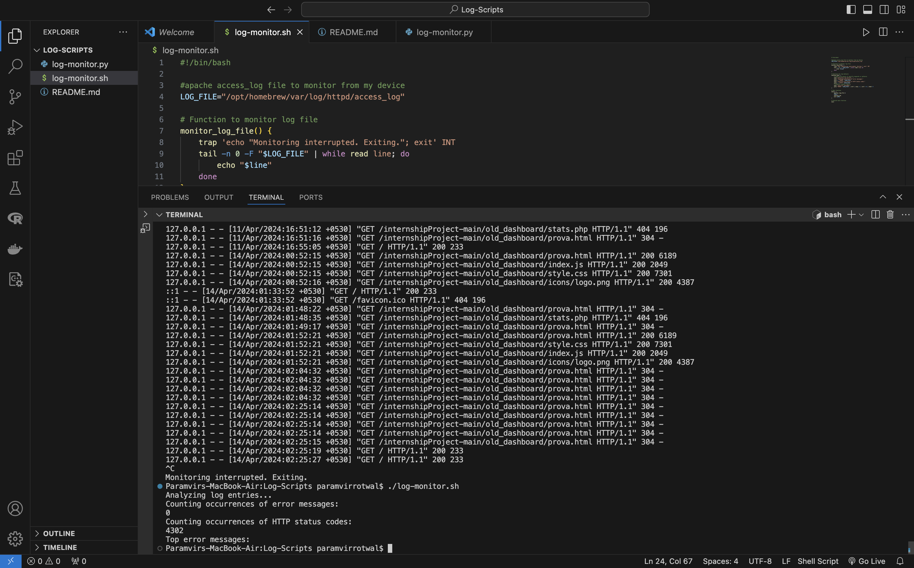

# Log Analysis and Monitoring Script

This repository contains the solution for the DevOps Internship Assignment, focusing on the creation of a script to automate the analysis and monitoring of log files.

## Overview

The Log Analysis and Monitoring Script is designed to provide real-time monitoring of specified log files, along with basic log analysis functionalities such as counting occurrences of specific keywords or patterns and generating summary reports.

## Solution Structure

The solution consists of the following files:

- `log-monitor.py`: Python script implementing the Log Analysis and Monitoring functionalities.
- `log-monitor.sh`: Shell script implementing the Log Analysis and Monitoring functionalities.
- `README.md`: This file, providing instructions for using and testing the script.

## Getting Started

To use and test the Log Analysis and Monitoring Script, follow these steps:
1. **Make Directory**: 

- `mkdir log-scripts`
  
- `cd log-scripts`

2. **Install Dependencies** (if any): If the script has any dependencies, make sure they are installed. This information will be provided in the README or script itself.

3. **Configure the Script**: Open the `log-monitor.py` script in a text editor and configure any necessary parameters, such as the path to the log file to monitor.

 We are using apache access_log file to monitor : `/opt/homebrew/var/log/httpd/access_log`
 
4. **Run the Script**: Execute the Python script using the following command:

A. **For python**: ```python3 log-monitor.py```

B. **For shell**: 
1. Give the permissions: ```chmod +x log-monitor.sh```
2. Execute command: ```./log-monitor.sh```


5. **Monitor Output**: The script will start monitoring the specified log file and display new entries in real-time. It will also perform basic log analysis and generate summary reports.



6. **Interrupt Monitoring**: To stop the monitoring loop, press `Ctrl+C` in the terminal. This will send an interrupt signal to the script, causing it to exit gracefully.

## License

This project is licensed under the [MIT License](LICENSE), which means you are free to use, modify, and distribute the code as you see fit. See the LICENSE file for more details.

